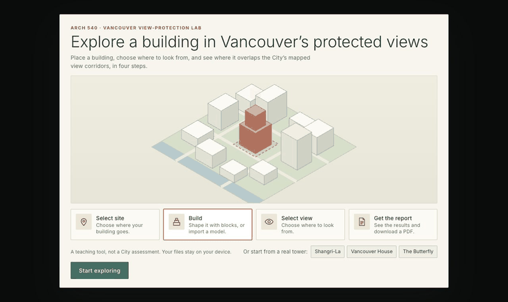
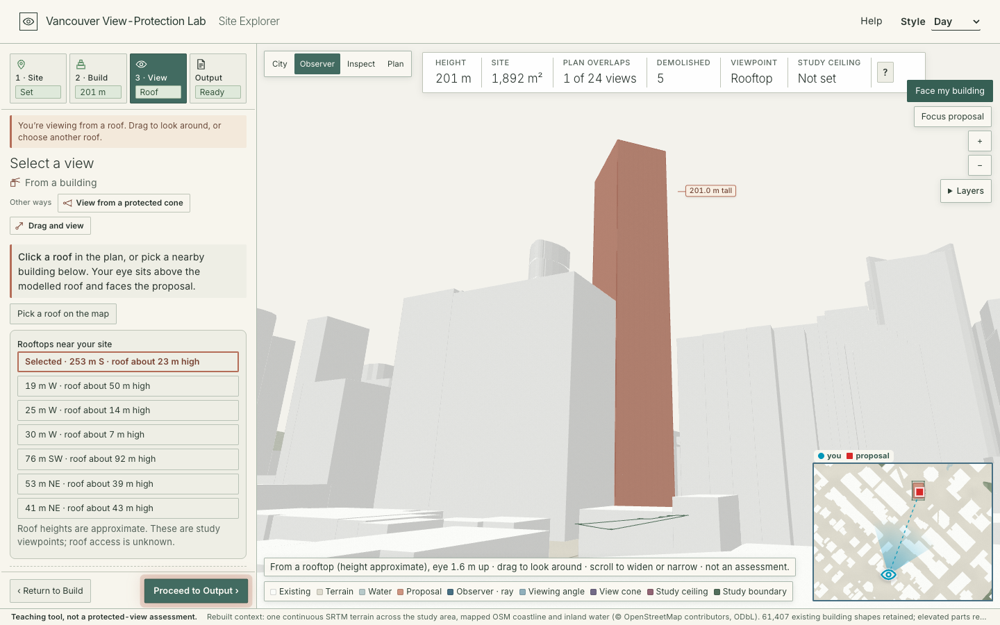

# Vista — Vancouver View Protection Tool

**[Open the tool in your browser](https://ruijieliu6.github.io/vancouver-tall-view-tool/)** · [Report an issue or a review](https://github.com/RuijieLiu6/vancouver-tall-view-tool/issues/new) · ARCH 540, Assignment 1 · release v09.16 (October 2, 2026)

[Watch the recorded demo (2:04)](https://drive.google.com/file/d/1DWnL5P9Co1HlqFtK4MfyUDTMS3ZeET8c/view) · [Replay the opening animation](https://ruijieliu6.github.io/vancouver-tall-view-tool/?intro=1)

The captioned demo follows address search, site placement, tower height and rotation, rooftop viewing, protected viewpoints, and PDF export. A visible pointer and click highlights make the interactions easier to follow. The recording starts with a skyline view; the separate opening-animation link always replays the introduction, including on a return visit.

## 1. Purpose

Vancouver's protected public views shape where and how towers can be built, but the corridors are difficult to read against a design proposal. I made Vista for architecture students and early-stage designers who want to explore a massing idea before a formal assessment. Choose a downtown site, build or import a proposal, and see which of the City's mapped view corridors its footprint overlaps. Then inspect approximate views from a corridor's polygon-derived origin, a nearby roof, or a point on the ground, and export a visual report. The City's open-data polygons contain plan boundaries but no cone height limits. The tool reveals spatial relationships and design questions; it does not decide whether a building meets the Public Views Guidelines.

## 2. How to use it

The tool is a web page; it needs no installation. Open the link above in a desktop browser with WebGL2 (recent Chrome, Edge, Firefox or Safari). The first visit shows a short introduction; **Help** in the top bar opens it again. New here? **Or start from a real tower** on the introduction loads a complete study of Shangri-La Vancouver, Vancouver House or The Butterfly in one click.

The tool works in four steps. In each step you choose one method; the panel then offers the other methods as buttons if you want to switch, **Proceed** moves on and **Return** goes back.

1. **Site.** *Open spot on the plan*: optionally find an area with a neighbourhood or a downtown address (suggestions appear as you type; **Place site here** puts the site at the address), then click open ground or draw a boundary. *Replace a building* or *Replace several buildings*: click buildings in the plan, then use them as the site.
2. **Build.** *Build on the platform*: stack and size blocks (height, width, depth, rotation, offsets). *Import a model*: a Rhino `.3dm` or `.obj` file, read on your device. Existing buildings under the proposal are shown as demolished; a checkbox keeps them.
3. **View.** *View from a protected cone*: select a viewpoint, then click **View from here** to stand at an approximate origin derived from the mapped polygon. *View from a building*: stand on a modelled roof. *Drag and view*: press a spot in the plan, drag toward what you want to see and release. Before entering a viewpoint, **Free inspection** lets you orbit the model. The corner map stays visible, previews the selected origin, and shows your position and viewing direction after you enter.
4. **Output.** A one-sentence summary, then the mapped view corridors that overlap the proposal in plan; optionally test a study ceiling (your own assumption, not a City limit), then choose the **PDF contents** and **Export PDF**. Every protected view whose corridor overlaps the proposal gets a page with existing and proposed views from its polygon-derived origin, a key plan and a section. **Start a new study** clears everything.

The strip above the map summarizes the study as you work; **?** at its end explains each number. **Style** in the top bar switches between Day and Night. **Layers** adds labels, roads and an experimental 2022 aerial photo texture. The map also works from the keyboard: arrow keys move the view, + and − zoom, and Enter acts at the centre of the view.

## 3. Source

- City of Vancouver, [*Public Views Guidelines*](https://guidelines.vancouver.ca/guidelines-public-views.pdf), approved by Council July 10, 2024, last amended February 4, 2026.
  - Section 2, Application and Intent (p.3): a protected view is an origin point, view cones with two vertical boundaries, and a horizontal lower boundary (the maximum height).
  - Section 3.1, Table 1 (pp.4–6): the protected public views, their origin points and subjects.
  - Section 3.2, Building Height and Massing, clause printed 3.1.1 (p.6): no part of a building should encroach into the relevant view cones. Clauses 3.1.2 to 3.1.5 (pp.6–7) are shown as text for people to judge.
- City of Vancouver open data, [view-cones](https://opendata.vancouver.ca/explore/dataset/view-cones/) (plan polygons only; the cone heights are not in this dataset).

The tool computes the plan relation between your proposal and each mapped corridor, renders each view from an origin estimated from its polygon, and compares the proposal with a height *you* set. It does not test the City's cone heights, view shadows (3.3) or Exceptional Downtown Sites (3.4).

## 4. One example

**Input.** Start from the real tower **Shangri-La Vancouver** (1128 W Georgia St, 201 m, 62 storeys, 2008): the four modelled parts of the tower are replaced (*Replace several buildings*) and one block of the published height stands on their footprint (29 × 43 m, approximate). View from the roof of a modelled building about 253 m south of the site (roof about 23 m high), eye 1.6 m above the roof.

**Result.** One mapped view corridor overlaps the block in plan: **3.2.1 Queen Elizabeth Park**. Turn on the height experiment with a 180 m study ceiling and it reads **21.0 m above your study ceiling**, your own assumption, not a City limit. To reproduce it, choose **Shangri-La** under *Or start from a real tower* on the intro (or in step 1), or open [`media/example-study.json`](media/example-study.json) with **Study file › Open study**. The other two presets are **Vancouver House** (1480 Howe St, 152 m to roof, 52 storeys, 2020, BIG with DIALOG; no corridor overlaps it in plan) and **The Butterfly** (969 Burrard St, 170 m to roof, 57 storeys, 2024, Revery Architecture; one overlap, 3.2.1). Heights are the published roof heights; footprints are approximate.

## 5. Skill and limits

- Building heights come from OpenStreetMap and the supplied model and are unverified; the model's vertical datum is unknown. Terrain is approximate (60 m SRTM).
- View-cone heights are not in the open data, so the tool cannot show whether a building rises into a cone. Plan overlap and the study ceiling are not a City assessment.
- Study boundaries and replaced-building outlines are approximate model outlines, not legal parcels.
- Viewpoint origins are estimated from polygon geometry, not verified survey coordinates; the applicable by-law is authoritative. Rendered views are exploratory, not verified sightlines. Imported models are checked by their part bounding boxes.
- The address box sends what you type to the City of Vancouver open-data portal (once, to load downtown addresses) and to the BC Address Geocoder for suggestions. The aerial texture loads City orthophoto tiles. Studies and PDF reports are made on your device and are not uploaded.
- A person must check any result against the City's by-laws and the Public Views Guidelines.

## Sources and attribution

- View cones and 2022 orthophotos: City of Vancouver Open Data, [Open Government Licence – Vancouver](https://opendata.vancouver.ca/pages/licence/). City civic addresses: [property-addresses](https://opendata.vancouver.ca/explore/dataset/property-addresses/), same licence.
- Address geocoding: © Province of British Columbia, [BC Address Geocoder](https://digital.gov.bc.ca/bcgov-common-components/bc-address-geocoder/), [Open Government Licence – British Columbia](https://www2.gov.bc.ca/gov/content/data/open-data/open-government-licence-bc).
- Streets, water, parks and simplified buildings outside the supplied model: © [OpenStreetMap contributors](https://www.openstreetmap.org/copyright), [ODbL](https://opendatacommons.org/licenses/odbl/). Terrain and mountains: NASA SRTM via [Open Topo Data](https://www.opentopodata.org/).
- The central Vancouver context is a derived browser export of a supplied studio Rhino model; the original `.3dm` file is not included. Interface type: [Inter](https://rsms.me/inter/) (SIL Open Font Licence).

This bundle is generated with `tools/build_pages.py` from a private working project; `release-manifest.json` lists every file with its size and SHA-256 hash.
